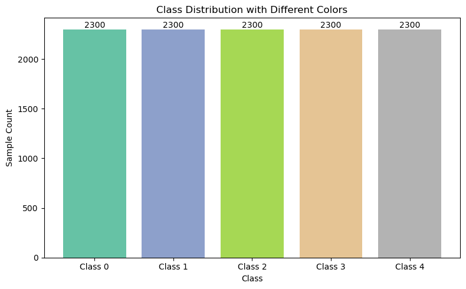
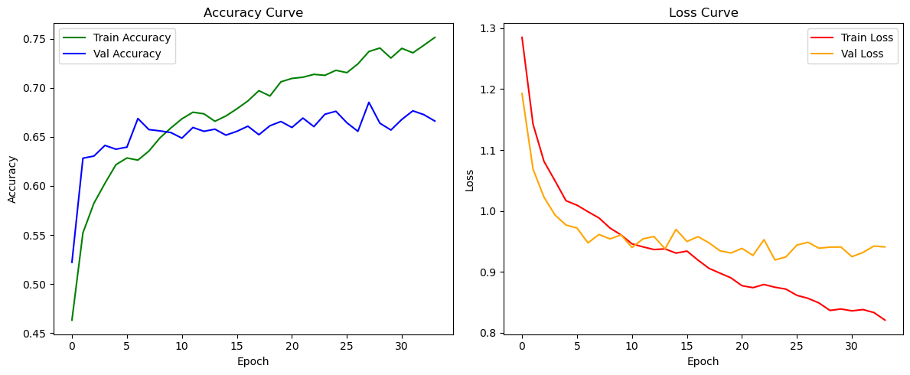

# Epileptic Seizure Detection using EEG Signals

An **epileptic seizure** is a sudden burst of electrical activity in the brain that can temporarily affect how it functions. Seizures may cause uncontrolled movements, sensations, behaviors, or a loss of awareness. Accurate detection of seizures is crucial for diagnosis and treatment planning, especially for people suffering from epilepsy.

An **Electroencephalogram (EEG)** is a test that measures electrical activity in the brain using electrodes placed on the scalp. Because seizures originate from abnormal electrical discharges, EEG signals are a reliable way to detect them.

---

## Dataset Description: `data.csv`

This project uses the **Epileptic Seizure Recognition Dataset** from the [UCI Machine Learning Repository](https://archive.ics.uci.edu/dataset/303/epileptic+seizure+recognition).

### Original Dataset Summary

- **500 subjects**, each with EEG recordings for **23.6 seconds**, sampled into **4097 data points**.
- Each file corresponds to one subject and contains time-series EEG signals.
- These signals were divided into **23 chunks of 178 data points**, giving **11500 rows** in total.
- Each row represents **1 second** of brain activity (178 values), and one label column (`y`) representing the class.

| Class | Description |
|-------|-------------|
| 1     | Epileptic seizure activity |
| 2     | EEG from tumor region (non-seizure) |
| 3     | EEG from healthy brain area with tumor |
| 4     | EEG with eyes closed |
| 5     | EEG with eyes open |

**Note**: Only class `1` represents epileptic seizure activity. Classes 2–5 are non-seizure recordings. Many researchers use this dataset for **binary classification**: seizure (1) vs. non-seizure (2–5).

### Class Distribution Visualization

---

## Models Used

### 1️. Artificial Neural Network (ANN)

- A fully connected deep neural network with multiple dense layers.
- Input: 178 EEG features per second.
- Output: 5-class softmax classifier.
- Trained using categorical crossentropy loss and the Adam optimizer.

**Accuracy & Loss vs. Epochs**

 

---

### 2️. Hybrid ANN + CNN Model

- A hybrid model that combines:
  - 1D Convolutional Layers to extract local temporal features.
  - Dense Layers (ANN) to classify based on extracted patterns.
- This model leverages both spatial and statistical patterns in EEG signals.

**Accuracy & Loss vs. Epochs**

 

---